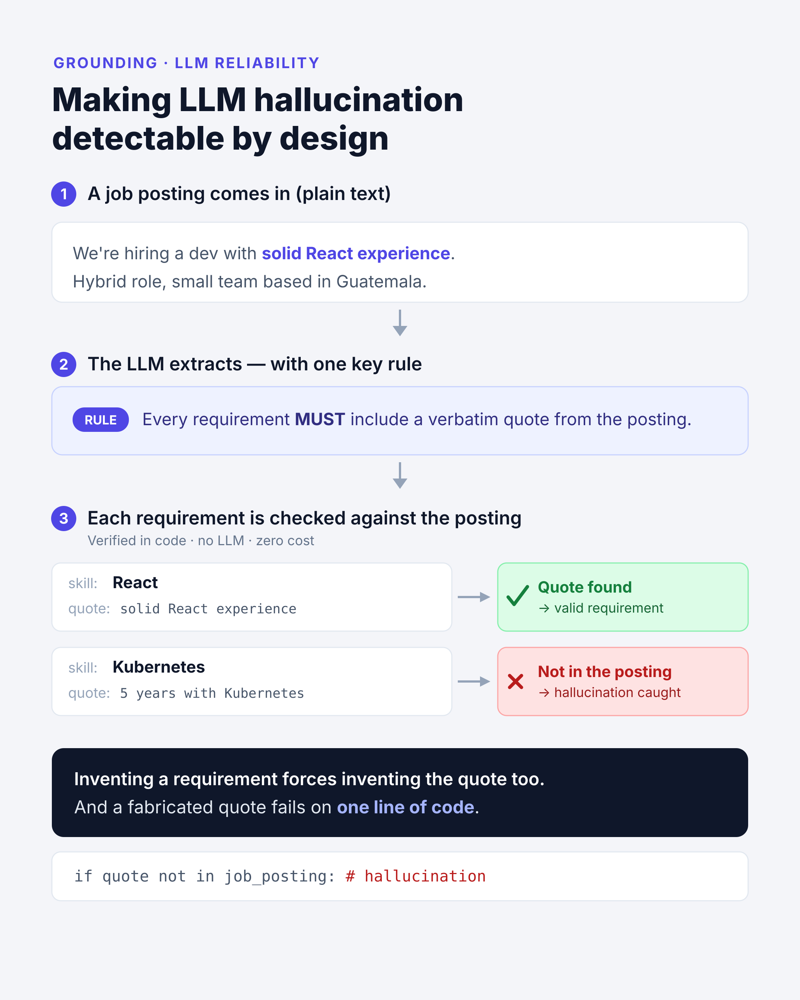

# TailorApply

> An LLM pipeline that tailors a job application to a specific posting — built to treat **reliability as a design decision**, not an afterthought.


TailorApply takes a job posting and a CV and produces a tailored cover letter and rewritten résumé bullets. The interesting part is not the output — plenty of tools do that. It's that the pipeline is designed so **every claim it makes is grounded in your real CV and the real posting, and is automatically verified**. Most "AI cover letter" tools happily invent experience you don't have. This one is built not to.

I'm building it as part of my AI Engineering learning path, as a hands-on way to practice the patterns that actually matter in production: structured outputs, grounding, lightweight evals, self-healing validation, and cost-aware model routing.

---

## Why this project

Two problems, one pipeline:

- **For the user:** tailoring an application to each posting is slow and tedious, and generic AI tools produce text that either sounds hollow or fabricates qualifications — which is worse than no help at all.
- **For me (the engineering goal):** an LLM that writes about *your* experience is a perfect setting to practice the hardest problem in applied GenAI — keeping the model anchored to the source and *proving* it stayed anchored.

---

## What it does — the full pipeline

The system is a chain of focused LLM calls, each with a single responsibility and a strict output contract.

```
   Job posting (plain text)          CV (plain text)
            |                              |
            v                              v
   +------------------+          +------------------+
   | 1. Extract job   |          | 2. Extract CV    |   cheap model
   |    profile       |          |    profile       |   JSON + grounding
   +--------+---------+          +--------+---------+
            |                             |
            +--------------+--------------+
                           v
                +----------------------+
                | 3. Gap analysis      |   grounded evidence
                |    + fit score       |   + honest summary
                +----------+-----------+
                           v
                +----------------------+
                | 4. Generate letter   |   stronger model
                |    + rewritten bullets|  streamed, tone-aware
                +----------+-----------+
                           v
                +----------------------+
                | 5. Evaluate & improve|   evaluator-optimizer
                |    (stretch goal)     |  loop, capped iterations
                +----------------------+
```

---

## Project status

This is a build-in-public project. I'm shipping it one call at a time and documenting the lessons as I go.

| Step | What it does | Status |
| --- | --- | --- |
| 1 | Extract a structured profile from the job posting + verify grounding | ✅ Implemented |
| 2 | Extract a structured profile from the CV | ✅ Implemented |
| 3 | Gap analysis with grounded evidence and a fit score | ✅ Implemented |
| 4 | Generate a tailored cover letter (streamed, tone-configurable) | ✅ Implemented |
| 5 | Evaluator-optimizer loop that critiques and improves the letter | ✅ Implemented |

---

## The grounding mechanism

The core reliability idea lives in Step 1 and propagates through the whole pipeline. Instead of telling the model *"don't hallucinate"* (which barely works), it is **required to attach a verbatim quote from the source to every requirement it extracts**. A fabricated requirement therefore forces a fabricated quote — and a fabricated quote is caught by a single, free, LLM-free check: does this string actually appear in the original text?



This turns reliability from an act of faith into something verifiable.

---

## Key engineering decisions

The decisions below are the actual point of the project — they're what separate "calling an API" from building a reliable LLM system.

**The prompt is the contract; the schema is the inspector.**
In JSON mode the model never sees the Pydantic models. The contract lives in the prompt; Pydantic only verifies the model honored it. This reframes prompt-writing: field descriptions become instructions, not documentation.

**JSON mode guarantees syntax, not your schema.**
`response_format={"type": "json_object"}` returns syntactically valid JSON — it does *not* guarantee your structure. The model can omit a field, invent an enum value, or return a string where you expected a list. So every response is validated against a schema; validation is not optional.

**Grounding is an architecture, not an instruction.**
Mandatory verbatim citations make fabrication structurally detectable (see above). A `verify_grounding()` function — deterministic, no LLM, runs in microseconds — checks every quote against the source and flags any that don't match. It's the project's first eval.

**Self-healing validation retry.**
When validation fails, the Pydantic `ValidationError` is fed back to the model as a correction prompt — it already states exactly which field failed and why, so it's a near-perfect instruction at zero authoring cost. Retries are capped, and the pipeline fails loudly rather than degrading silently on corrupt data.

**Model routing by cost.**
Extraction and classification run on a cheap model; the final writing (Step 4) uses a stronger one. Routing by task is a real cost/quality/latency lever, and being able to justify the trade-off per step is the difference between using an API and engineering with one.

**Prompt-injection defense via delimiters.**
Source text is wrapped in explicit delimiters so the model has a clear boundary between *content to analyze* and *instructions to follow* — a job posting could contain text that looks like a command.

---

## Tech stack

- **Python 3.11+**
- **OpenAI SDK** — chat completions, JSON mode, streaming
- **Pydantic v2** — schema definition and validation between calls
- **python-dotenv** — configuration

The provider is isolated behind a single module (`llm_client.py`), so swapping to another backend means touching one file.

---

## Project structure

```
tailorapply/
├── src/tailorapply/
│   ├── config.py          # model routing + input limits
│   ├── schemas.py         # Pydantic contracts between calls
│   ├── prompts.py         # all system prompts in one place
│   ├── llm_client.py      # call_json(): retries, parsing, validation
│   └── steps.py           # pipeline steps as pure functions
├── examples/              # sample job postings + expected outputs
├── assets/                # diagrams
├── run_paso1.py           # run Step 1 end-to-end
└── requirements.txt
```

Prompts are deliberately separated from logic: prompts are the part you iterate on the most, and changing them shouldn't mean touching code.

---

## Getting started

```bash
# 1. Clone
git clone https://github.com/<your-username>/tailorapply.git
cd tailorapply

# 2. Create and activate a virtual environment
python -m venv .venv
source .venv/bin/activate        # Windows: .venv\Scripts\activate

# 3. Install dependencies
pip install -r requirements.txt

# 4. Configure your API key
cp .env.example .env
# edit .env and set OPENAI_API_KEY=sk-...

# 5. Run Step 1 against a sample posting
python run_paso1.py examples/oferta_ejemplo.txt
```

---

## Example

**Input** (`examples/oferta_ejemplo.txt`, plain text):

```
Backend Engineer (Python) — Kapital Pagos
...
Requisitos:
- 3+ años de experiencia desarrollando backend con Python.
- Experiencia sólida con FastAPI o Django en producción.
...
Deseable:
- Conocimientos de Kubernetes y Terraform.
```

**Output** (`JobProfile`, abbreviated):

```json
{
  "role_title": "Backend Engineer (Python)",
  "seniority": "mid",
  "requirements": [
    {
      "skill": "Python",
      "category": "must_have",
      "quote": "3+ años de experiencia desarrollando backend con Python."
    },
    {
      "skill": "Kubernetes y Terraform",
      "category": "nice_to_have",
      "quote": "Conocimientos de Kubernetes y Terraform."
    }
  ],
  "ats_keywords": ["Python", "FastAPI", "Django", "PostgreSQL", "AWS", "..."],
  "culture_signals": ["valora el ownership", "..."]
}
```

**Grounding check:**

```
[OK] Grounding verified: every quote exists verbatim in the posting.
```

---

## Roadmap

- [x] Step 1 — job posting → structured profile, with grounding verification
- [x] Step 2 — CV → structured profile
- [x] Step 3 — gap analysis (fit score + grounded, evidence-backed matches)
- [x] Step 4 — cover letter generation (streaming, configurable tone)
- [x] Step 5 — evaluator-optimizer loop (critique → improved draft)
- [ ] CLI polish and a small set of regression examples (proto-evals)

---

## Acknowledgments

The starting point was a brochure-generator lab from an LLM engineering course, which I extended into a multi-call pipeline with a strong focus on grounding and verification. The reliability patterns are my own emphasis.

---

## License

MIT — see [LICENSE](LICENSE).